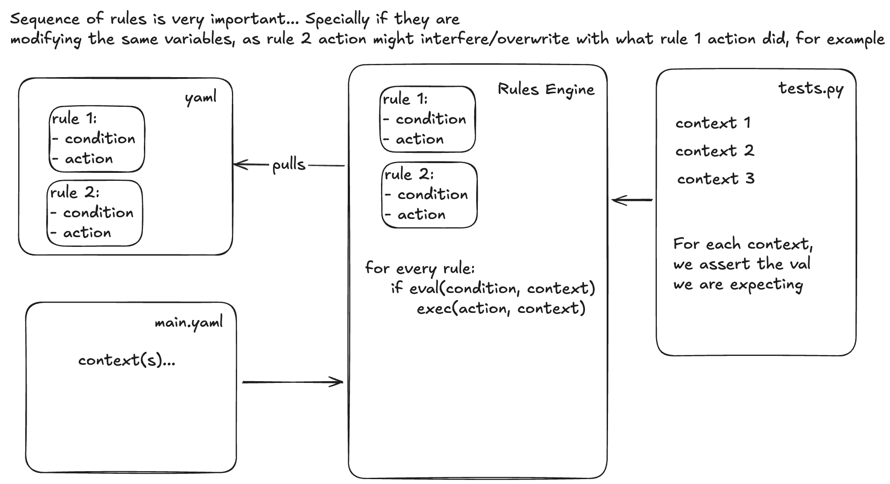
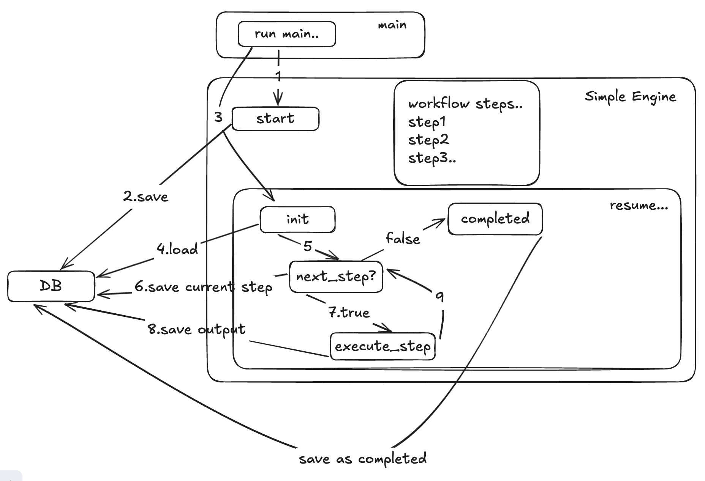
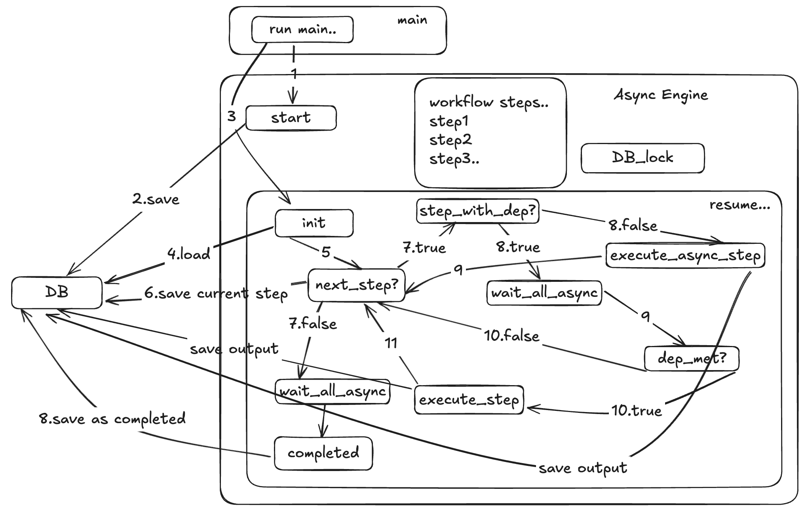

# Practice...

## Table of Contents

- [Practice...](#practice)
  - [Table of Contents](#table-of-contents)
  - [What is a rule engine?](#what-is-a-rule-engine)
    - [Useful links and Libs..](#useful-links-and-libs)
    - [Videos...](#videos)
      - [PyCon Sweden](#pycon-sweden)
    - [Concrete example](#concrete-example)
  - [Durable Execution Engine](#durable-execution-engine)
    - [Simple Engine](#simple-engine)
    - [Async Engine](#async-engine)
  - [Two way sync](#two-way-sync)
    - [FinOps recommendation engine](#finops-recommendation-engine)
      - [WIP/Notes](#wipnotes)
  - [Infrastructure deployment automation and orchestration](#infrastructure-deployment-automation-and-orchestration)
    - [Some vendors..](#some-vendors)
    - [Orchestrating Infrastructure](#orchestrating-infrastructure)
      - [SaaS vs Dedicated vs Self-Hosted](#saas-vs-dedicated-vs-self-hosted)
- [SQL vs NoSQL? - Actually, Relational and NON-Relational databases](#sql-vs-nosql---actually-relational-and-non-relational-databases)
  - [Relational DB](#relational-db)
  - [NON-Relational DB](#non-relational-db)

Repository structure:
- durable_execution_engine: folder with the durable execution engines
- images: folder with images - mostly used in this readme
- rules_engine: folder with different rules engines
- README.md: overview of this project + some info on two way sync


## What is a rule engine?

A rule engine uses rules, which are conditional statements, to evaluate inputs. By having rules in a yaml file we can more easily maintain the code for the engine and better scale to use different rules for different purposes (the engine just consumes the rules).



### Useful links and Libs..

- Discussion: https://stackoverflow.com/questions/53421492/python-rule-based-engine
- clipspy: https://clipspy.readthedocs.io/en/latest/
  - https://pypi.org/project/clipspy/
- rule-engine: https://pypi.org/project/rule-engine/
- durable_rules: https://github.com/jruizgit/rules
- pyke: http://pyke.sourceforge.net/index.html
- pyknow: https://github.com/buguroo/pyknow
- intellect: https://github.com/nemonik/Intellect
- business-rules: https://github.com/venmo/business-rules
- drools: https://www.drools.org/

### Videos...

Simple example with and without clipspy: https://www.youtube.com/watch?v=0HQSCXU-8NA

#### PyCon Sweden
PyCon Sweden: https://www.youtube.com/watch?v=Lsi1ZhmbNDc

Rules Rule - practice_4

https://martinfowler.com/bliki/RulesEngine.html

https://pypi.org/project/funnel-rules-engine/

https://github.com/funnel-io/funnel-rules-engine

### Concrete example

https://coplane.com/perspectives/building_reliable_ai

practice_7

## Durable Execution Engine

practice_5

Implemented 2 types: 
- just a simple one to execute jobs sequentially without support for parallel execution.
- A more complex one with support for parallel execution and we can define dependencies for each job - if no dependency then it runs async until it hits a job with dependency then it waits for all the async jobs to finish - it then checks if depedencies are met and it either executes or moves on to the next job.

### Simple Engine



### Async Engine



## Two way sync

### FinOps recommendation engine

A engine that gathers data from different sources, generates recommendations to save money, then distributes these recommendations as tickets in different Jira boards to be assigned to the owner of that infrastructure/resource. It also syncs back from Jira to the engine itself to maintain the state of the ticket in our DB.


recommendations table
```
id, created_at, recommendation, resource
1,10,resize,VM1
2,12,delete,VM2
3,15,delete,VM3
4,17,resize,VM1
5,18,delete,VM4
6,19,resize,VM5
```

recommendations_generated
```
id, last_successful_recommendation_generated
1,16
2,20
```

if recommendation, resource are the same, for example in entry 1 and 4 where resize,VM1 == resize,VM1 then it's a repeated recommendation. We should only create the ticket for 1 and then 4 is just the "last_created"

to know if ticket created or not check recommendation_ticket_map table
when making a recommendation. When querying - limit it to search by created_at - if script runs every 1 week to generate recommendation, then to search for "repeated" recommendations in that limit - we can get the last recommendation date by getting last_successful_recommendation_generated from the "generated recommendations table"

tickets table
```
id, created_at, status, 
1,110,created,
2,112,created,
3,115,created,
4,118,closed,
5,119,closed,
```

recommendation_ticket_map table
id(supressed),recommendation_id,first_recommendation_id,ticket_id
```
1,1,1
2,2,2
3,3,3
4,1,1
5,5,4
6,6,5
```

a distributor to push to 3 party
a "monitoring" to pull data from the 3 party in a set interval - how can we query the 3 party? what are the options we have?
GET data FROM users WHERE updated=(from last_pool_time to now)

last_pool_time we keep in our own side to know when was the time of the last successful data pull.

How to resume a execution that failed???

We can have partial runs - so what we can do is that for each run to create the tickets we are actually checking for last_successful_recommendation_generated - if it was 2 weeks ago then it failed....

How can we improve this? We need to track a few things in the DB:
- current recommendation we are generating (like the durable workflow engine we need to keep track of the current recommendation/jira ticket being created so we can resume later)
- ... WIP

#### WIP/Notes

maintaining data consistency and enabling seamless collaboration between different platforms. defining sync rules, mapping fields, automating updates, and ensuring secure, real-time data exchange between the platforms

https://exalate.com/blog/two-way-integration/

## Infrastructure deployment automation and orchestration

We would probably be looking into CI/CD and using the info from state file.. rules in OPA as part of the pipeline to enforce some of our rules..

Important things in any pipeline:
- Security scans
  - Vulnerabilities
  - Secrets
- Tests
  - passing unit tests
  - functional
  - integration
  - end-2-end
  - smoke..
- Terraform and/or tf Workspace config:
  - tracking branch/tag..
  - auto-apply
  - auto-apply run triggers (cascade changes into other workspaces that are orchestrating resources that must be changed in case a previous workspace was modified)
  - a workspace with "global outputs" to help orchestrate
    - Remote state sharing organization wide.
    - have several "global" workspaces, 1 for global networks, 1 for users info, etc and then from the "global_outputs" we can agreggate those global ones into only one.
  - reusable modules - publish them in a resgistry, version them and make sure we have a workflow to orchestrate changes in all repositories

### Some vendors..

spacelift: https://spacelift.io/
terragrunt: https://terragrunt.gruntwork.io/

### Orchestrating Infrastructure

SaaS vs Dedicated vs Self-Hosted

Control plane always SaaS? Data stored centrally? Maintenance? Cost?

#### SaaS vs Dedicated vs Self-Hosted

| Feature/Question         | SaaS                          | Dedicated                      | Self-Hosted                   |
|-------------------------|-------------------------------|--------------------------------|-------------------------------|
| **Control plane**       | Always managed by provider    | Can be managed or customer     | Fully managed by customer     |
| **Data storage**        | Centrally (provider's cloud)  | Can be isolated per customer   | On-premises or customer cloud |
| **Maintenance**         | Handled by provider           | Shared or customer responsibility | Fully customer responsibility |
| **Cost**                | Subscription, pay-as-you-go   | Higher, often per-customer     | Upfront infra + maintenance   |

**Other...**
- Control plane always SaaS?
- Data stored centrally?
- Maintenance?
- Scalability?
- Cost for SaaS is usually lower as infra is shared
- SaaS hybrid with namespace isolation for workloads and other types of isolation for data


# SQL vs NoSQL? - Actually, Relational and NON-Relational databases
<!-- ref: https://www.youtube.com/watch?v=YgTLqO54UOA  -->
SQL - query language; and NoSQL - refers to non-relational databases that usually use different languages...

## Relational DB
Diff tables and each table represents one type of data model. Many to many relationships: foreign keys.. used to represent relationship between rows in diff tables - "normalized".
Can levarage Join - Left, inner and outer?

Downside: distributed transactions can be slow.

Good for data represented by relationship... 

<!-- ### MySQL and PostgreSQL -->
<!-- https://www.youtube.com/watch?v=x6-RN-_i5Xs -->
relational/normalized data - one reference to the one piece of data and have it stay consistent across the database.

Common features:
- Tend to be B-Tree based for indexing. (better reads?)
- Single leader replication. (avoid write conflicts?) but multi-leader replication is also possible.
- Configurable isolation levels - ACID
  - atomicity, consistency, isolation, durability

Scale vertically

## NON-Relational DB
Better data locality but has repeated data.. Keep all the data we need in one single record. Will lead to more writes as well as it's denormalized. Writes can be pretty complicated if we have to write the data in multiple places 

Good to use when data can be kept as separate messages/records - no relationship between them.

Good to scale horizontally - Kind of a key value store.. easier to split workload and only part of DB owned by a workload - diff partitions - where is an item stored? Key value store.. key determines in which partition the item is stored - where to store new items and retrieve existing one? Hash and then go to the host assign to that range's hash.

<!-- https://www.mongodb.com/resources/basics/scaling -->