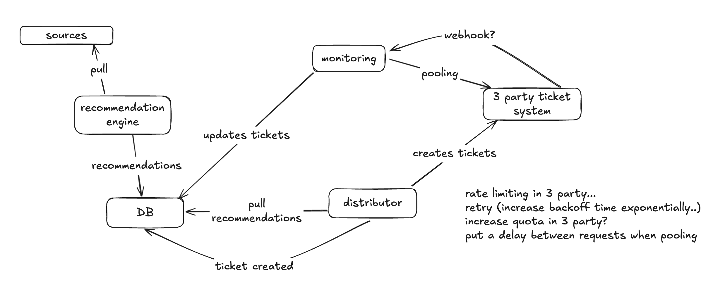

# Practice...

Repository structure:
- practice_`<number>`: folder with practice code...
- interview: folder used in the interview

## What is a rule engine?

A rule engine uses rules, which are conditional statements, to evaluate inputs. By having rules in a yaml file we can more easily maintain the code for the engine and better scale to use different rules for different purposes (the engine just consumes the rules).

### Practice

#### practice_1

#### practice_2

#### practice_3

#### practice_4

rules engine from pycon...

### Useful links and Libs..

- Discussion: https://stackoverflow.com/questions/53421492/python-rule-based-engine
- clipspy: https://clipspy.readthedocs.io/en/latest/
  - https://pypi.org/project/clipspy/
- rule-engine: https://pypi.org/project/rule-engine/
- durable_rules: https://github.com/jruizgit/rules
- pyke: http://pyke.sourceforge.net/index.html
- pyknow: https://github.com/buguroo/pyknow
- intellect: https://github.com/nemonik/Intellect
- business-rules: https://github.com/venmo/business-rules
- drools: https://www.drools.org/

### Videos...

Simple example with and without clipspy: https://www.youtube.com/watch?v=0HQSCXU-8NA

#### PyCon Sweden
PyCon Sweden: https://www.youtube.com/watch?v=Lsi1ZhmbNDc

Rules Rule - practice_4

https://martinfowler.com/bliki/RulesEngine.html

https://pypi.org/project/funnel-rules-engine/

https://github.com/funnel-io/funnel-rules-engine

## Durable Execution Engine

practice_5

## Two way sync

### FinOps recommendation engine

A engine that gathers data from different sources, generates recommendations to save money, then distributes these recommendations as tickets in different Jira boards to be assigned to the owner of that infrastructure/resource. It also syncs back from Jira to the engine itself to maintain the state of the ticket in our DB.



maintaining data consistency and enabling seamless collaboration between different platforms. defining sync rules, mapping fields, automating updates, and ensuring secure, real-time data exchange between the platforms

https://exalate.com/blog/two-way-integration/

recommendations table
```
id, created_at, recommendation, resource
1,10,resize,VM1
2,12,delete,VM2
3,15,delete,VM3
4,17,resize,VM1
5,18,delete,VM4
6,19,resize,VM5
```

recommendations_generated
```
id, last_successful_recommendation_generated
1,16
2,20
```

if recommendation, resource are the same, for example in entry 1 and 4 where resize,VM1 == resize,VM1 then it's a repeated recommendation. We should only create the ticket for 1 and then 4 is just the "last_created"

to know if ticket created or not check recommendation_ticket_map table
when making a recommendation. When querying - limit it to search by created_at - if script runs every 1 week to generate recommendation, then to search for "repeated" recommendations in that limit - we can get the last recommendation date by getting last_successful_recommendation_generated from the "generated recommendations table"

tickets table
```
id, created_at, status, 
1,110,created,
2,112,created,
3,115,created,
4,118,closed,
5,119,closed,
```

recommendation_ticket_map table
id(supressed),recommendation_id,first_recommendation_id,ticket_id
```
1,1,1
2,2,2
3,3,3
4,1,1
5,5,4
6,6,5
```

a distributor to push to 3 party
a "monitoring" to pull data from the 3 party in a set interval - how can we query the 3 party? what are the options we have?
GET data FROM users WHERE updated=(from last_pool_time to now)

last_pool_time we keep in our own side to know when was the time of the last successful data pull.

How to resume a execution that failed???

We can have partial runs - so what we can do is that for each run to create the tickets we are actually checking for last_successful_recommendation_generated - if it was 2 weeks ago then it failed....

How can we improve this? We need to track a few things in the DB:
- current recommendation we are generating (like the durable workflow engine we need to keep track of the current recommendation/jira ticket being created so we can resume later)
- 
